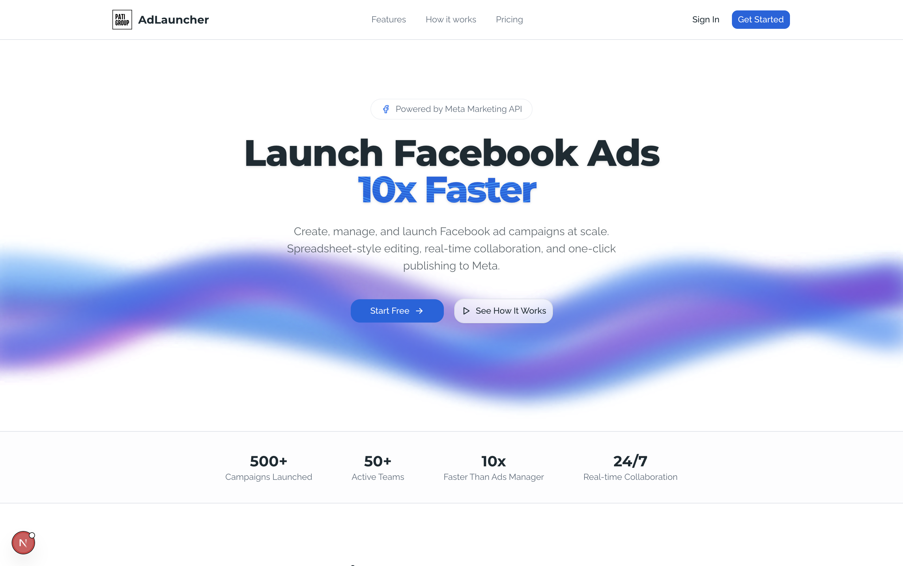

<p align="center">
  
</p>

<h1 align="center">AdLauncher</h1>

<p align="center">
  An internal tool to manage and launch Facebook/Meta ads in bulk —<br/>
  built for agency teams running multiple campaigns across multiple ad accounts.
</p>

---

## Screenshots



---

## Features

- **Multi-org workspace** — create multiple organizations, invite members with admin/editor roles
- **Facebook connection** — OAuth flow to sync Business Managers, Pages, and Ad Accounts from Meta
- **Creative management** — upload images/videos, set headline, primary text, CTA, and destination URL
- **Ad creation & launch** — configure targeting (age, gender, location), budget, schedule, then push directly to Meta API
- **Campaign dashboard** — view campaigns, ad sets, and ads with insights (impressions, clicks, spend)
- **Realtime collaboration** — presence avatars and live creative updates via Supabase Realtime
- **Email invitations** — invite team members via email with a 7-day token

## Tech Stack

| Layer | Technology |
|---|---|
| Framework | Next.js 16 (App Router, Turbopack) |
| Language | TypeScript |
| UI | React 19, Tailwind CSS v4, shadcn/ui |
| Backend | Supabase (PostgreSQL, Auth, Storage, Realtime) |
| Ads API | Meta Marketing API v25.0 |
| Email | Resend |

## Requirements

- Node.js 20+
- [Supabase](https://supabase.com) account
- Facebook App with `business_management`, `ads_management`, `ads_read`, `pages_show_list`, `pages_read_engagement` permissions
- [Resend](https://resend.com) account for sending emails

> **HTTPS domain required**
>
> Meta API **does not accept** `localhost` or plain HTTP for OAuth callbacks and Marketing API calls. The app **must be deployed on a domain with HTTPS** before the Facebook connection feature will work. See [Deploy](#deploy).

## Installation

```bash
git clone <repo-url>
cd auto_launch_ads
npm install
```

Copy the env file:

```bash
cp .env.example .env.local
```

Fill in all variables in `.env.local` (see the guide below).

## Database Setup

Run the full schema file in the Supabase SQL Editor:

```
supabase/schema.sql
```

This creates all tables, enums, RLS policies, triggers, and enables Realtime on the `creatives` table.

## Running Locally

```bash
npm run dev
```

Open [http://localhost:3000](http://localhost:3000).

> Note: the **Connect Facebook** feature will not work on localhost because Meta requires HTTPS. Use [ngrok](https://ngrok.com) or deploy to a staging environment to test the OAuth flow.

## Deploy

The app must run on an **HTTPS domain** for the Meta API to function. Some options:

| Platform | Notes |
|---|---|
| [Vercel](https://vercel.com) | Easiest option, HTTPS automatic |
| [Railway](https://railway.app) | Node.js support, HTTPS automatic |
| VPS (Nginx + Certbot) | Self-managed, manual SSL setup required |

After deploying, make sure to update:
1. `NEXT_PUBLIC_APP_URL` in your env to the real domain
2. **Facebook App → Settings → Valid OAuth Redirect URIs** — add `https://your-domain.com/api/facebook/callback`
3. **Supabase → Authentication → URL Configuration** — add your domain to Site URL and Redirect URLs

## Production Build

```bash
npm run build
npm run start
```

## Project Structure

```
app/
  (dashboard)/          # Authenticated pages
    ads/                # Ad list & creation
    campaigns/          # Campaign dashboard + insights
    pages/              # Facebook Pages management
    settings/           # Org settings, members
    upload-ads/         # Bulk creative upload
  api/                  # API routes
    ads/                # CRUD ads, launch to Meta
    creatives/          # Upload & manage creatives
    facebook/           # OAuth callback, sync BM/Pages/AdAccounts
    invitations/        # Create & accept invitations
    meta/               # Proxy Meta Graph API (campaigns, insights)
    orgs/               # Create & manage organizations
  auth/                 # Login, register, OAuth callback
  invite/               # Invitation acceptance page
components/             # UI components
hooks/                  # Custom hooks (presence, realtime, settings)
lib/
  supabase/             # Client, server, admin, middleware helpers
  facebook.ts           # Meta Graph API wrappers
  email.ts              # Resend email templates
  auth.ts               # Auth helpers
supabase/
  schema.sql            # Full database schema
```

## Environment Variables

See `.env.example` for the full list.

### Supabase keys

1. Go to [app.supabase.com](https://app.supabase.com) → select your project → **Settings → API**
2. `NEXT_PUBLIC_SUPABASE_URL` — Project URL
3. `NEXT_PUBLIC_SUPABASE_PUBLISHABLE_KEY` — `anon` public key
4. `SUPABASE_SERVICE_ROLE_KEY` — `service_role` key (server-side only, never expose to the client)

### Facebook App

1. Go to [developers.facebook.com](https://developers.facebook.com) → **My Apps → Create App**
2. Select type **Business**
3. Add products **Facebook Login** and **Marketing API**
4. **Settings → Basic** → copy `App ID` and `App Secret`
5. Add OAuth redirect URI: `https://your-domain.com/api/facebook/callback`
6. Under **App Review → Use Cases**, add and customize permissions: `ads_management`, `ads_read`, `business_management`, `pages_manage_ads`

> **Dev mode:** While the app is in Development mode, only accounts added as **Admin or Tester** in the Facebook App can use OAuth. To allow other users, submit an App Review so Meta can approve the required permissions.

### Resend API key

1. Go to [resend.com](https://resend.com) → **API Keys → Create API Key**
2. Verify your domain to send emails from your own address (or use `onboarding@resend.dev` for testing)

## Scripts

```bash
npm run dev          # Dev server with Turbopack
npm run build        # Production build
npm run start        # Run production build
npm run lint         # ESLint
npm run typecheck    # TypeScript check
npm run format       # Prettier format
```

## Handover Notes

- `DESIGN.md` contains the full design system (colors, typography, component styles) based on the Meta Store design language
- All data is scoped by `org_id` with Supabase RLS — users only see data belonging to their organization
- `SUPABASE_SERVICE_ROLE_KEY` bypasses RLS — only use it in server-side API routes
- Facebook access tokens are stored in the `facebook_connections` table — rotate periodically or implement token refresh handling when tokens expire
- **Meta API requires HTTPS** — all OAuth flows and Marketing API calls must go through a domain with a valid SSL certificate
